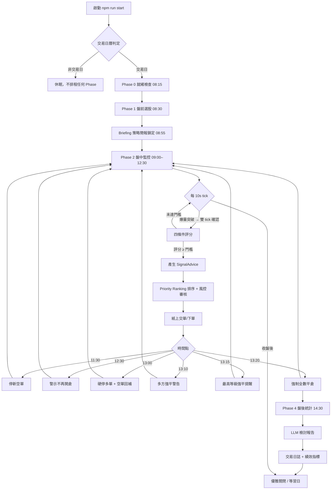

# tw-quant-daybrain

台股當沖 DayBrain — 盤前/盤中/盤後自動化交易決策引擎（TypeScript）。

- **語言/執行期**：TypeScript，Node.js ≥ 20
- **MCP**：`@modelcontextprotocol/sdk`（stdio，已實作連線層）
- **設定**：`config/*.yaml` + 環境變數覆寫（§17.1 為唯一真值）
- **日誌**：結構化 JSON（事件型，含 ts/type），`LOG_DIR` 可設定
- **時區**：固定 `Asia/Taipei`，禁止本機時區隱式轉換

> **給誰看**：本 README 是 **CLI / 使用者** 導向。想把 DayBrain 模組嵌進
> 自己的程式？見 [`docs/api.md`](docs/api.md)（TS API 參考）。

## 快速開始

```bash
npm install
npm run build      # tsc 編譯至 dist/
npm run test       # node:test 單元測試（離線全綠）
```

## 你有哪些 CLI 可用

所有命令都是「一行 + 一個目的」。`npm run start` 是唯一會真實跑交易決策的
入口；其餘都是**離線工具**（模擬、回測、驗證），不會下單。

**統一 CLI**：不想記個別 script，可用單一入口 `npm run cli -- <command>`，
`npm run cli -- help` 可隨時查看全部命令與參數：

```bash
npm run cli -- help                 # 查看所有命令與參數
npm run cli -- simulate             # 等同 npm run test:simulate
npm run cli -- fixture:record       # 等同 npm run fixture:record
npm run cli -- stress --tick-delay 5
```

| 命令 | 做什麼 | 何時用 |
|------|--------|--------|
| `npm run start` | 單進程部署：交易日自動執行完整流程、非交易日休眠 | **生產使用**（需 MCP_SERVER_BIN + 設定） |
| `npm run dev` | 同 start，但用 tsx 直接跑原始碼 | 開發時快速啟動 |
| `npm run test:simulate` | 模擬盤：用 fixture 劇本回放一整個交易日（Phase 0→4），看引擎按設計運作 | 改動後驗證引擎行為 |
| `npm run test:simulate:unit` | 模擬/故障注入單元測試（timeout/data_gap/connection_drop） | 驗證故障處理 |
| `npm run fixture:record` | 連線 tw-quant-mcp 錄製「最新交易日」fixture 至 `testdata/mcp/<date>.json`（盤中/盤後雙模式） | 交易日盤後跑，讓模擬盤跟上市場 |
| `npm run grid-search` | 參數網格搜尋：掃 42 種停損×爆量組合，找獲利高原 | 找參數（非交易日跑） |
| `npm run wfo` | Walk-Forward 滾動驗證：樣本外檢驗參數是否過擬合 | 驗證參數能不能上線（非交易日跑） |
| `npm run stress` | 全交易日壓測：10s tick 連續 09:00–13:30（1621 ticks），驗證無遺漏/記憶體穩定 | 部署前壓力測試 |
| `npm run experiment -- --param volume_surge_threshold --values 3.0,2.5,3.5` | 參數對比實驗：同一參數多組值跑模擬比績效 | 單一參數調校 |

> **grid-search / wfo 只掃離線歷史資料，不會下單**；產出的是「參數建議」，
> 上線前必須經 wfo 樣本外驗證（WFE > 60% 才 PASS）。

## 打包成單一可執行檔

不想裝 Node/Bun，可打包成**單一執行檔**（內嵌 Bun runtime，macOS arm64）：

```bash
npm run build:binary          # → dist/daybrain（約 61MB，單檔自含 runtime）
npm run build:binary -- --release   # 加 --minify 縮小
```

打包後直接執行，用法與 `npm run cli --` 完全相同：

```bash
./dist/daybrain help          # 查看命令
./dist/daybrain simulate      # 模擬盤
./dist/daybrain fixture:record
```

> 產物在 `dist/`（gitignore），可複製到任何 arm64 macOS 直接跑，不需 Node/Bun。
> Linux/Windows 需改 `--target`（bun-linux-x64 / bun-windows-x64）。

## 三種使用情境

### 情境 A：我想讓它每天自動跑（生產）

```bash
# 1. 設定 .env（MCP_SERVER_BIN、風控參數、資金池…），見 .env.example
# 2. 編譯 + 啟動
npm run build
npm run start
```

啟動後依 `config/scheduler.yaml` 時間軸自動執行（非交易日休眠）：

### 完整交易日流程

> 以下為整個決策引擎的一天：從啟動 → 盤前 → 盤中 → 強平 → 盤後，
> 以及非交易日的休眠分支。



> mermaid 在部分 Markdown 檢視器需外掛；若看不到圖，表格即為同一流程的文字版。

| 時間 | Phase | 動作 |
|------|-------|------|
| 08:15 | Phase 0 | 就緒檢查（交易日曆/行情源/權限） |
| 08:30 | Phase 1 | [盤前選股](docs/pre-market.md)（三路徑合併、去重、watchlist ≤ 15 檔） |
| 08:55 | Briefing | [策略簡報鎖定](docs/briefing.md)（Bias 決策樹） |
| 09:00–12:30 | Phase 2 | [盤中監控](docs/scoring.md)（每 10s tick：VWAP + 爆量偵測 + 雙 tick 確認 + 評分） |
| 11:30 | Phase 3 | 停止新空單訊號 |
| 12:30 | Phase 3 | 警示不再開倉 |
| 13:00 | Phase 3 | 硬停多單新訊號 + 空單強制回補 |
| 13:10 | Phase 3 | 多方強平警告（FORCE_FLAT_ALL） |
| 13:15 | Phase 3 | 未平倉最高等級強平提醒 |
| 13:20 | Phase 3 | 強制全數平倉（FORCE_CLOSE_AT） |
| 14:30 | Phase 4 | 盤後統計 + 交易日誌 |

優雅關閉：`SIGINT`/`SIGTERM` 或 `LOG_DIR/.shutdown` marker 檔 → 取消排程並
自然收尾（MCP close 帶 3 秒超時 + 子程序強殺）。

### 情境 B：我想看引擎今天會怎麼做（模擬盤）

```bash
npm run test:simulate
```

用 fixture 劇本（爆量突破→觸發→停利）回放一整個交易日，輸出人話化階段報告：
盤前自檢 → 選股 → 盤中訊號（含執行計劃：進場/停損/目標/RR/倉位）→ 尾盤強平
→ 盤後統計。引擎行為可逐筆回放（`src/tools/replay.ts`，見 docs/api.md）。

> 模擬盤驗證的是「引擎按設計運作」✅，不是「策略能賺錢」⏳——後者需要
> 真實多月歷史 1 分 K（`data/historical_1m/`）才有資格談。

#### 錄製最新交易日 fixture

內建 fixture（`testdata/mcp/intraday.json`）固定為某一歷史交易日（如 2026-08-10）。
想讓模擬盤跟上市場，可在交易日**盤後**錄製當日 fixture：

```bash
npm run fixture:record                      # 預設錄「最新交易日」→ testdata/mcp/<date>.json
npm run test:simulate -- --fixture testdata/mcp/<date>.json
```

選項：`--date YYYY-MM-DD`（指定日）、`--out <path>`（輸出位置）、
`--symbols a,b`（覆寫候選股）、`--ticks N`（盤中錄製 tick 數，預設 3）、
`--tick-gap-ms N`（tick 間隔）、`--server-bin <path>`（覆寫 MCP server）。

行為說明：
- **盤後錄製**（預設）：錄 Phase 0/1/4（法人買超、注意股、重大訊息、日 K），
  Phase 2/3 盤中 ticks 不錄（vwap/surge 非交易時段不可用）；watchlist 設定與
  `scan_daytrade_eligibility` 以當日資料近似合成，模擬重點在盤前選股與盤後統計。
- **盤中錄製**（09:00–13:20 執行）：額外錄 Phase 2/3 的 vwap/surge 即時回應。
- 錄製時自動做 v2.1 → daybrain 契約標準化（`_lineage.source` 對齊、Candle[]→candles
  等），並過濾權證代碼（6 位數）與未註冊 Symbol Registry 的標的。
- 需要 `.env` 的 `MCP_SERVER_BIN` 指向 tw-quant-mcp 二進位；連線失敗/暫時性
  registry 未同步會自動重試。

> fixture 的模擬日與資料日期必須一致（FreshnessGate 依此驗證新鮮度），
> 因此一律以錄製日為準，勿手改日期。

### 情境 C：我想找/驗證策略參數（回測）

```bash
npm run grid-search                        # 找獲利高原（42 組合）
npm run wfo                                # 樣本外驗證（WFE 判定）
npm run experiment -- --param volume_surge_threshold --values 3.0,2.5,3.5
```

三階段落差：grid-search 掃出候選參數 → wfo 用「調參期間/驗證期間」滾動窗口
做樣本外檢驗（WFE > 60% PASS、< 30% OVERFIT 絕不上線）→ experiment 對單一
參數做對比實驗。回測全部使用 `data/historical_1m/` 離線資料，不觸碰實盤。

## 目錄結構

```
src/
  mcp/          MCP Client 連線層（T002 ✅）：Envelope 解析、重試、breaker
  gate/        資料新鮮度守門（T003 ✅）：降級狀態機 NORMAL/STALE/DEGRADED/LOCKOUT
  bias/        盤前多空傾向鎖定（T016）
  engine/      策略引擎（T017/T018）；訊號評分模型（T007 ✅）；盤中監控循環（T009 ✅）
  briefing/    Tactical Briefing 產生器（T019）
  execution/   下單執行與 Priority Ranking（T010/T020）
  risk/        風控系統（T008）
  pre_market/  盤前流程（T006 ✅）：Phase 0 就緒檢查 + Phase 1 三路徑選股
  metrics/     交易日誌與績效指標（T010 ✅）
  llm/         LLM 檢討報告（T011 ✅）：Schema 驗證、白名單、llm_offline
  scheduler/   交易日曆與生命週期排程（T005 ✅）
  backtest/    回測與參數最佳化（T022-T024）
  tools/       回放工具（T012 ✅）：決策追溯、滑價驗證、JSON/可讀輸出
  logging/     結構化 JSON 日誌（T001 ✅）+ 事件日誌與回放（T004 ✅）
  config/      設定載入（yaml + env 覆寫）
  utils/       時區等共用工具
test/
  mock_mcp_server.ts  mock MCP server（T002 整合測試）
config/
  scoring.yaml    訊號評分表（§8.2）
  scheduler.yaml  交易日排程（§18.2）
docs/
  api.md            TS API 參考（給庫開發者）
  pre-market.md     盤前選股邏輯（Phase 0 + Phase 1）
  briefing.md       策略簡報（Tactical Briefing）
  scoring.md        盤中監控與四條件評分
  priority-ranking.md  Priority Ranking 排序 + 風控審核
logs/             執行日誌（LOG_DIR）
data/historical_1m/ 回測歷史 1 分 K（DATA_DIR）
testdata/mcp/     fixture 劇本（回放用）：intraday.json（固定日）+ <date>.json（fixture:record 錄製）
```

## 環境變數

全部變數定義於 `src/config/env_defaults.ts`（§17.1 唯一真值），範例見 `.env.example`。
覆寫方式：`SCORE_THRESHOLD=90 node dist/index.js`。

## 功能總覽

| 能力 | 說明 | 對應模組 |
|------|------|----------|
| **盤前選股** | Phase 0 就緒檢查 + Phase 1 三路徑選股、去重、watchlist ≤ 15 檔 | `pre_market/` · [詳見](docs/pre-market.md) |
| **多空傾向鎖定** | Bias Decision Tree：盤前把方向決策樹鎖定成白名單狀態檔 | `bias/` |
| **盤中監控** | 每 10s tick：VWAP + 爆量偵測 + 雙 tick 確認 + 四條件評分 | `engine/` · [詳見](docs/scoring.md) |
| **做多策略** | VWAP_SURGE_LONG：爆量突破 VWAP 進場，尾盤強平 | `engine/` |
| **做空策略** | BULL_TRAP_VWAP_SHORT：假突破回補做空，13:00 強制回補 | `engine/` |
| **風控系統** | 單筆風險比例、最大持倉數、每日最大虧損、族群上限 | `risk/` |
| **優先權派單** | Rank Score 排序 + Tier 資金分配 + 同族群 40% 上限 + 競爭搶單 | `execution/` · [詳見](docs/priority-ranking.md) |
| **紙上交單** | 模擬成交 + 滑價驗證，不碰真實帳戶 | `execution/paper_trader.ts` |
| **戰術簡報** | Tactical Briefing：盤前把 bias + 風控參數結構化輸出 | `briefing/` · [詳見](docs/briefing.md) |
| **交易日誌** | 績效指標 + 交易日誌（Phase 4 盤後統計） | `metrics/` |
| **LLM 檢討報告** | 收盤後自動生成檢討報告，Schema 驗證 + 白名單防幻覺 | `llm/` |
| **事件回放** | 決策可逐筆追溯（signal → 進場 → 平倉全鏈路） | `logging/` + `tools/` |
| **資料新鮮度守門** | NORMAL/STALE/DEGRADED/LOCKOUT 降級狀態機，壞資料不進決策 | `gate/` |
| **參數最佳化** | Grid Search（找高原）+ WFO（樣本外驗證）防過擬合 | `backtest/` |
| **自動排程** | 交易日曆 + 生命週期排程，非交易日自動休眠 | `scheduler/` |

> 詳細 API 見 [`docs/api.md`](docs/api.md)。

## 應用情境與可整合方向

DayBrain 本體是「**決策引擎**」——它算訊號、管風險、記帳、自我檢討，但**不主動送單到券商**。
可以當核心，接各種周邊；也可以拆模組單獨用。

| 環境 / 結合對象 | 怎麼用 | 要自己做什麼 |
|----------------|--------|-------------|
| **實盤下單**（券商 API） | 把 `signal_issued` / `position_opened` 事件接到券商下單 API（如永豐 Shioaji、群益 API） | 建轉接層：事件 → 下單指令；實盤前先用紙上交單對齊 |
| **模擬競賽 / 回測平台** | 用 `CsvDataLoader` 餵歷史資料，`DayBrainBacktestSimulator` 重放整日決策 | 準備多月份 1 分 K 歷史資料 |
| **Telegram / Line 通知** | 把 `system_shutdown`、`force_flat_final` 等紀律事件推送到手機，隨時知道引擎狀態 | 接 webhook（專案無內建推送） |
| **LLM 投顧助理** | 收盤後的 `LLMReport` 當作 AI 投顧素材，或餵給另一個 LLM 做盤前摘要 | 接 LLM provider（llm_offline 可離線降級） |
| **回測研究管線** | grid-search → wfo → 參數漂移監控，形成「參數健康檢查」流程 | 定期跑 CLI + 記錄報告 |
| **多人研究協作** | 事件日誌 JSON Lines 格式 → 可匯入資料庫 / BI 工具分析 | 建 ETL 匯入自有分析棧 |
| **演算法競賽 / 教學** | 模組化 TypeScript 設計 + 完整測試，可當量化交易教學骨架 | 無 |
| **雲端部署**（Docker / VM） | `npm run start` 無頭執行，`LOG_DIR` 掛 volume 持久化 | 包 Dockerfile + 設定 cron 自動重啟 |
| **策略研究**（內部） | 用 `experiment` 做單一參數對比，用 `stress` 驗證穩定性 | 無 |

> 專案目前為**研究/模擬用途**（paper trading），接實盤前請自行評估風險與法規。

## 免責聲明

本專案為**研究/模擬用途**（paper trading），不構成任何投資建議。
所有訊號由規則引擎產生，經模擬盤（fixture 回放）驗證；實際交易前請自行評估風險。
自動化交易可能因資料延遲、系統故障或市場異常造成損失，使用者須自負全責。

---

規格書：`~/tasks/tw-quant-daybrain/tw-quant-daybrain-v2_1.md`

## License

本專案採用 **Apache License 2.0** 授權。

- 完整授權條款見 [`LICENSE`](LICENSE)（專案根目錄）
- Apache-2.0 官方條款：<https://www.apache.org/licenses/LICENSE-2.0>
- 版權與貢獻者資訊以 LICENSE 檔案為準

> 本專案為研究/模擬用途，授權條款不構成任何投資建議或保證；
> 使用/修改/再散佈前請詳閱 LICENSE 全文。
